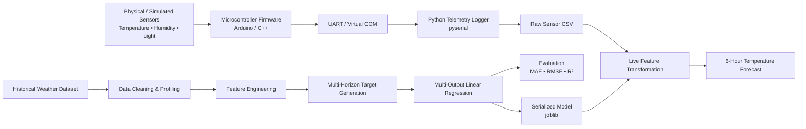

# IoT Weather Station & Multi-Step Temperature Forecasting System

An end-to-end engineering project that demonstrates how **sensor telemetry can be acquired from a microcontroller simulation, streamed into Python, stored as structured data, and connected to a machine-learning forecasting pipeline**.

The project combines:

- **Proteus** for a hardware/sensor simulation
- **C++/Arduino firmware** for sensor acquisition and telemetry generation
- **Python** for serial telemetry logging and CSV generation
- A historical **weather dataset** for ML development
- **Feature engineering + Multi-Output Linear Regression** for 6-hour temperature forecasting
- **`joblib` model serialization** and a Python inference pipeline for live-style prediction

> **Important scope note:**  
> The Proteus + Arduino + Python section is intentionally a **proof-of-concept simulation of an embedded data-acquisition workflow**. It demonstrates the engineering interface between simulated hardware and software; it is not presented as the production hardware used to collect the historical weather dataset.  
>
> The ML dataset is a separate historical weather dataset used for model development and evaluation. The simulation demonstrates how a similar real-world sensor acquisition layer could feed a data pipeline.

---

## 1. Project Objective

The project explores an end-to-end architecture for a weather-monitoring and temperature-forecasting system.

At the embedded layer, environmental measurements are generated by a simulated sensing circuit. The microcontroller formats the measurements and transmits them over a serial interface.

A Python middleware component reads the serial stream, validates the telemetry, and stores the readings in CSV format.

Separately, a historical weather dataset is processed to train a **multi-output regression model** that predicts temperature over the next six hourly horizons:

$$
t+1,\ t+2,\ t+3,\ t+4,\ t+5,\ t+6
$$

The final inference pipeline converts incoming sensor data into the same feature schema used during training and produces a six-step temperature forecast.

---

## 2. End-to-End Architecture



### Architectural separation

A key design decision in this project is the separation of two data paths:

| Layer | Purpose | Data Source |
|---|---|---|
| Embedded simulation | Demonstrate sensor acquisition and telemetry | Proteus + Arduino |
| Telemetry logging | Demonstrate sensor-to-software integration | Python serial logger |
| Historical ML pipeline | Train and evaluate forecasting model | Historical weather dataset |
| Live-style inference | Demonstrate deployment interface | Incoming sensor payload |

This separation avoids conflating the simulated sensor stream with the historical training dataset.

---

# 3. Repository Structure

A professional GitHub repository can use the following structure:

```text
weather-forecasting-edge-ai/
│
├── README.md
├── LICENSE
├── .gitignore
├── requirements.txt
│
├── hardware/
│   ├── proteus/
│   │   ├── Temperature_detect_data_collect.pdsprj
│   │   └── Temperature_detect_data_collect.pdsprj.M...
│   │
│   └── firmware/
│       └── Temperature_detect_data_collect_C++_source_code.ino
│
├── logger/
│   └── logger.py
│
├── data/
│   ├── raw/
│   │   └── sensor_dataset_sample.csv
│   └── processed/
│       └── weather_processed.csv
│
├── ml/
│   ├── ML Model.ipynb
│   ├── ML Model_documented.ipynb
│   ├── inference.py
│   └── temperature_linear_model.pkl
│
├── docs/
│   └── TECHNICAL_DOCUMENTATION.pdf
│
└── assets/
    ├── protues_simulation.png
    ├── python_script.png
    ├── CSV_Data_file.png
    └── Model Evaluation.png
```

### Mapping from the current project

The current Windows project already contains the same logical layers:

```text
Collected_data_from_Sensor/
Logger/
ML Model/
photos/
schematic/
Temperature_detect_data_collect_C++_source_code.ino/
TECHNICAL_DOCUMENTATION.pdf
```

The recommended structure mainly makes the separation between **hardware, data acquisition, data, machine learning, documentation, and visual assets** explicit.

---

# 4. Hardware & Proteus Simulation

## 4.1 Purpose

The Proteus project is used to demonstrate the embedded acquisition concept before moving to physical hardware.

The simulation contains an Arduino Uno-based sensing circuit with environmental inputs and serial communication.

The goal is not to claim that the simulation is the production sensing platform. Its purpose is to validate the software interface and data-flow concept:

```text
Sensor → MCU → Serial Telemetry → Python
```

## 4.2 Main simulated components

| Component | Role |
|---|---|
| Arduino Uno | Embedded controller and telemetry source |
| DHT11 | Temperature and humidity sensing |
| LDR | Light-intensity sensing |
| Resistor network | LDR signal conditioning |
| Virtual Serial / COM interface | Transfers telemetry from Proteus to the host |
| Virtual terminal | Provides a direct view of transmitted values |

The observed telemetry demonstrates measurements such as:

```text
Temperature
Humidity
Light Intensity
```

Example serial output:

```text
27.00,80.00,10
27.00,80.00,49
27.00,80.00,975
36.00,87.00,341
```

The exact ordering and encoding are defined by the embedded firmware and logger implementation.

---

# 5. Embedded Firmware

The firmware is responsible for:

1. Reading the sensor interfaces.
2. Formatting the measurements.
3. Sending the telemetry through the serial interface.
4. Providing a machine-readable stream for the Python logger.

Conceptually:

```text
Initialize peripherals
       ↓
Read sensors
       ↓
Validate / format values
       ↓
Transmit serial record
       ↓
Repeat
```

The firmware forms the boundary between the **embedded domain** and the **data-engineering domain**.

---

# 6. Python Telemetry Logger

The Python logger acts as middleware between the Proteus virtual serial interface and the local dataset.

Its main responsibilities are:

```text
Virtual COM Port
      ↓
pyserial
      ↓
Parse incoming telemetry
      ↓
Timestamp record
      ↓
Write CSV
```

The collected CSV uses fields such as:

| Field | Meaning |
|---|---|
| `Timestamp` | Time at which the reading was received |
| `Temperature_C` | Sensor temperature |
| `Humidity_Pct` | Relative humidity |
| `Light_Intensity` | LDR-derived intensity value |

Example:

```csv
Timestamp,Temperature_C,Humidity_Pct,Light_Intensity
20/09/2026 20:31,38,85,975
20/09/2026 20:31,38,85,975
20/09/2026 20:32,42,85,975
20/09/2026 20:32,35,85,683
20/09/2026 20:32,29,85,683
```

## Why this layer matters

The logger demonstrates an important embedded/AI systems pattern:

> **Do not couple the model directly to hardware I/O.**

Instead, the acquisition layer produces structured telemetry, while the ML layer consumes standardized records.

This makes it easier to replace Proteus with:

- a physical Arduino
- an ESP32
- another MCU
- a Raspberry Pi gateway
- an MQTT or HTTP telemetry source

without fundamentally changing the forecasting model.

---

# 7. Historical Weather Dataset

The forecasting model is trained using a separate historical weather dataset.

The dataset contains approximately **526k records across 20 districts** and provides substantially richer meteorological variables than the small simulated sensor stream.

The important architectural distinction is:

```text
Simulated sensor CSV
        ≠
Historical ML training dataset
```

The simulation demonstrates **how live sensor data could be acquired**.

The historical dataset provides the **feature richness and temporal history required to train the forecasting model**.

This separation is intentional and should remain explicit in the repository documentation.

---

# 8. Machine Learning Pipeline

The ML workflow is implemented in the Jupyter notebook.

```text
Historical Dataset
       ↓
Data Inspection
       ↓
Data Cleaning
       ↓
Temporal Processing
       ↓
Feature Engineering
       ↓
Target Construction
       ↓
Chronological Train/Test Split
       ↓
Multi-Output Linear Regression
       ↓
Evaluation
       ↓
Model Serialization
```

## 8.1 Data preprocessing

The data-processing stage handles:

- timestamp conversion
- temporal ordering
- district-wise organization
- missing-value treatment
- preparation of continuous and categorical variables

The temporal structure is particularly important because the target represents future observations.

Randomly shuffling time-series observations would create a risk of temporal leakage, so chronological splitting is used.

---

# 9. Feature Engineering

The model uses engineered temporal, environmental, categorical, and state-dependent variables.

## 9.1 Cyclical time encoding

Clock and calendar variables are periodic.

For hour of day:

$$
hour_{sin} = \sin\left(\frac{2\pi h}{24}\right)
$$

$$
hour_{cos} = \cos\left(\frac{2\pi h}{24}\right)
$$

For month:

$$
month_{sin} = \sin\left(\frac{2\pi m}{12}\right)
$$

$$
month_{cos} = \cos\left(\frac{2\pi m}{12}\right)
$$

This prevents the artificial discontinuity between:

```text
23:00 → 00:00
```

because both values are represented as adjacent points on a periodic manifold.

---

## 9.2 Logarithmic transformations

Highly skewed physical variables are transformed using:

$$
x' = \ln(1+x)
$$

The pipeline applies this transformation to variables such as:

- rainfall
- wind speed

This reduces the influence of extreme values and provides a more numerically stable representation for regression.

---

## 9.3 Event flags

Additional binary indicators are derived from meteorological conditions, including:

- `heatwave_flag`
- `heavy_rain_flag`
- `storm_flag`

These variables provide the model with explicit regime information rather than forcing the regression layer to infer every event state from continuous variables alone.

---

## 9.4 Weather-condition encoding

The categorical variable `weather_condition` is represented using one-hot encoded features.

Conceptually:

```text
Clear        → [1,0,0,...]
Cloudy       → [0,1,0,...]
Rain         → [0,0,1,...]
...
```

This allows the linear regression model to incorporate non-numeric weather regimes without assigning an artificial ordinal relationship.

---

# 10. Multi-Horizon Forecasting

The forecasting target consists of six future temperatures:

$$
Y_t =
\begin{bmatrix}
T_{t+1} &
T_{t+2} &
T_{t+3} &
T_{t+4} &
T_{t+5} &
T_{t+6}
\end{bmatrix}
$$

The future values are constructed using negative temporal shifts.

For horizon $h$:

$$
y^{(h)}_t = T_{t+h}
$$

which corresponds conceptually to:

```python
temperature.shift(-h)
```

Therefore:

```text
t+1 → next hour
t+2 → two hours ahead
t+3 → three hours ahead
t+4 → four hours ahead
t+5 → five hours ahead
t+6 → six hours ahead
```

The result is a **multi-output regression problem**, where a single feature vector produces six temperature predictions.

---

# 11. Model

The deployed model is a **Multi-Output Linear Regression** formulation.

For an input feature vector $x$:

$$
\hat{Y} = xW + b
$$

where:

- $x$ is the feature vector
- $W$ contains the learned coefficients
- $b$ contains the output intercepts
- $\hat{Y}$ contains the six forecast temperatures

This formulation is attractive for constrained edge deployments because inference consists primarily of matrix/vector multiplication and addition.

There is no requirement to execute a neural-network runtime or perform iterative optimization during inference.

---

# 12. Model Performance

The final reported evaluation results are:

| Forecast Horizon | MAE (°C) | RMSE (°C) | $R^2$ |
|---|---:|---:|---:|
| t+1 | 1.75 | 2.22 | 0.9445 |
| t+2 | 1.78 | 2.26 | 0.9429 |
| t+3 | 1.81 | 2.29 | 0.9411 |
| t+4 | 1.82 | 2.28 | 0.9415 |
| t+5 | 1.80 | 2.29 | 0.9413 |
| t+6 | 1.79 | 2.27 | 0.9421 |

### Interpretation

The error remains relatively stable across the complete six-hour horizon.

The observed performance range is approximately:

$$
MAE \approx 1.75 - 1.82^\circ C
$$

$$
RMSE \approx 2.22 - 2.29^\circ C
$$

$$
R^2 \approx 0.9411 - 0.9445
$$

The absence of a large degradation from $t+1$ to $t+6$ is consistent with a model that benefits from strong temporal structure in temperature and from engineered representations of daily and seasonal cycles.

The model should nevertheless be interpreted as a **regression baseline for edge deployment**, not as proof that linear regression is universally optimal for meteorological forecasting.

---

# 13. Real-Time Inference

The repository also contains `inference.py`, which demonstrates the deployment interface.

Its role is:

```text
Incoming sensor payload
        ↓
Validation / fallback handling
        ↓
Feature engineering
        ↓
Feature-order alignment
        ↓
Serialized model
        ↓
Six-hour forecast
```

The inference implementation maintains a small state memory containing values such as:

- previous valid temperature
- previous valid humidity
- previous valid rainfall
- previous valid wind speed
- previous valid cloud cover
- `temp_lag_1`

If an incoming payload is not marked as normal, the implementation falls back to the last valid sensor values before constructing the model input.

This is a practical edge-system pattern because sensor data streams are not guaranteed to be continuously valid.

---

# 14. Strict Feature Schema

One of the most important deployment constraints is **training/inference feature consistency**.

The inference layer loads the serialized model artifact and retrieves the expected feature list.

The live feature vector is then explicitly reordered to match the training schema before prediction.

Conceptually:

```text
Raw Sensor Payload
        ↓
Derived Features
        ↓
One-Hot Weather Features
        ↓
Missing Feature Completion
        ↓
Exact Training Feature Order
        ↓
Model.predict(...)
```

This prevents a subtle but serious deployment failure mode where correct feature values are supplied in the wrong column order.

---

# 15. Edge Deployment Strategy

Two main deployment paths are possible.

## Option A — Single-Board Computer

Example:

```text
MCU → Serial / MQTT → Raspberry Pi
                         ↓
                    Python Runtime
                         ↓
                   joblib Model
                         ↓
                    Forecast
```

Advantages:

- easiest integration with the existing Python inference code
- full NumPy/pandas ecosystem
- simple model replacement
- easier debugging and monitoring

This is the most direct extension of the current prototype architecture.

## Option B — Bare-Metal MCU Inference

The trained linear model can be exported as coefficients.

For six outputs:

$$
\hat{y}_j =
\sum_{i=1}^{n} w_{ij}x_i + b_j
$$

The multiplication and accumulation can then be implemented directly in C/C++.

Advantages:

- low runtime overhead
- no Python interpreter
- no external ML runtime
- suitable for highly constrained deployments

Trade-offs include:

- manual model conversion
- numerical precision management
- feature preprocessing replication
- stricter memory constraints
- more difficult model updates

For the current project, the **Raspberry Pi/SBC path is the more direct bridge between the existing Python inference layer and a physical sensor system**, while MCU-only inference is a natural future optimization.

---

# 16. Failure Modes & Boundary Conditions

A production implementation should explicitly test the following cases.

| Scenario | Risk | Mitigation |
|---|---|---|
| Sensor timeout | Missing current measurement | Last-valid-value fallback |
| Invalid telemetry | Corrupt feature vector | Validation before inference |
| Night/day transition | Cyclical discontinuity | Sine/cosine time encoding |
| Seasonal transition | Calendar discontinuity | Month sine/cosine encoding |
| Heavy rain | Highly skewed rainfall | `log1p` transform + event flag |
| Strong wind | Extreme-value sensitivity | `log1p` transform + storm flag |
| Unknown weather category | Feature-schema mismatch | Complete missing one-hot columns with 0 |
| Feature order mismatch | Incorrect prediction | Explicit schema reordering |
| Serial disconnect | Telemetry interruption | Error handling and reconnection logic |
| Out-of-distribution weather | Reduced model reliability | Monitoring and retraining policy |

---

# 17. Verification Strategy

A complete engineering verification plan should be divided into four levels.

### Level 1 — Embedded verification

Verify:

- sensor values are generated correctly
- serial records are emitted correctly
- firmware remains stable during continuous acquisition

### Level 2 — Telemetry verification

Verify:

- COM/serial connection
- parsing
- timestamp generation
- CSV writing
- handling of invalid or incomplete records

### Level 3 — ML verification

Verify:

- chronological train/test split
- target alignment
- feature schema
- no NaN contamination
- model serialization/deserialization
- metric reproducibility

### Level 4 — End-to-end verification

Verify:

```text
Sensor
  ↓
Firmware
  ↓
Serial
  ↓
Python
  ↓
Feature Engineering
  ↓
Model
  ↓
6-Hour Forecast
```

The most important end-to-end test is not simply whether each component runs independently, but whether the **same feature semantics and ordering are preserved across training and deployment**.

---

# 18. Data & GitHub Repository Policy

The historical weather file is relatively large.

For a public GitHub repository, a cleaner approach is:

```text
data/
├── sample/
│   └── weather_sample.csv
└── README.md
```

and then provide instructions for obtaining the full dataset separately.

For large versioned datasets, **Git LFS** can be used.

This avoids turning the source-code repository into a large binary/data archive while keeping the project reproducible.

The same principle applies to generated files such as:

- large CSV datasets
- temporary logs
- virtual environments
- IDE metadata
- Python cache files
- Proteus build artifacts

---

# 19. Recommended GitHub Presentation

A portfolio-oriented repository should make the engineering story understandable in under one minute.

The recommended reading order is:

```text
README
  ↓
Architecture
  ↓
Hardware / Simulation
  ↓
Data Acquisition
  ↓
ML Pipeline
  ↓
Results
  ↓
Inference / Deployment
  ↓
Technical Documentation
```

The repository should make one architectural point especially clear:

> **The project demonstrates the complete path from embedded sensing to machine-learning inference, while keeping the simulated acquisition layer and the historical ML dataset logically separate.**

---

# 20. Project Status

| Component | Status |
|---|---|
| Proteus hardware simulation | Implemented |
| Arduino/C++ sensor acquisition | Implemented |
| Virtual serial telemetry | Implemented |
| Python telemetry logger | Implemented |
| CSV sensor logging | Implemented |
| Historical weather preprocessing | Implemented |
| Feature engineering | Implemented |
| Six-step target generation | Implemented |
| Multi-output linear regression | Implemented |
| Model evaluation | Implemented |
| Serialized model | Implemented |
| Live-style inference script | Implemented |
| Physical hardware deployment | Not the current project scope |
| MCU-native inference | Future extension |

---

# 21. Technical Documentation

The repository also contains the detailed engineering report:

```text
docs/TECHNICAL_DOCUMENTATION.pdf
```

This document provides the deeper architecture, hardware, firmware, telemetry, ML, deployment, and verification analysis.

---

# 22. Visual Assets

The `assets/` directory contains project evidence such as:

- Proteus simulation screenshot
- Python logger screenshot
- collected CSV screenshot
- model evaluation results

These assets are intended to provide visual confirmation of the implementation stages.

---

# 23. Future Engineering Extensions

Potential next steps include:

1. Replace Proteus-only sensing with a physical environmental sensor node.
2. Introduce MQTT for network telemetry.
3. Deploy inference on a Raspberry Pi or equivalent SBC.
4. Export linear-regression weights for direct MCU inference.
5. Add model/version metadata to the deployment artifact.
6. Add automated telemetry validation and monitoring.
7. Compare the linear baseline against tree-based and neural forecasting models.
8. Add confidence intervals or uncertainty estimation.
9. Introduce continuous data collection and scheduled model retraining.
10. Add automated CI validation for the feature schema and inference pipeline.

---

## 24. Technologies

- **Embedded:** Arduino / C++
- **Simulation:** Proteus
- **Communication:** UART / Virtual COM
- **Middleware:** Python, `pyserial`
- **Data Processing:** Pandas, NumPy
- **Machine Learning:** Scikit-learn
- **Profiling:** ydata-profiling
- **Model Serialization:** Joblib
- **Notebook Environment:** Jupyter
- **Version Control:** Git / GitHub

---

#

## 25. References

- GitHub Documentation: https://docs.github.com/
- Git Large File Storage: https://git-lfs.com/
- Scikit-learn: https://scikit-learn.org/
- Pandas: https://pandas.pydata.org/
- NumPy: https://numpy.org/
- Jupyter: https://jupyter.org/
